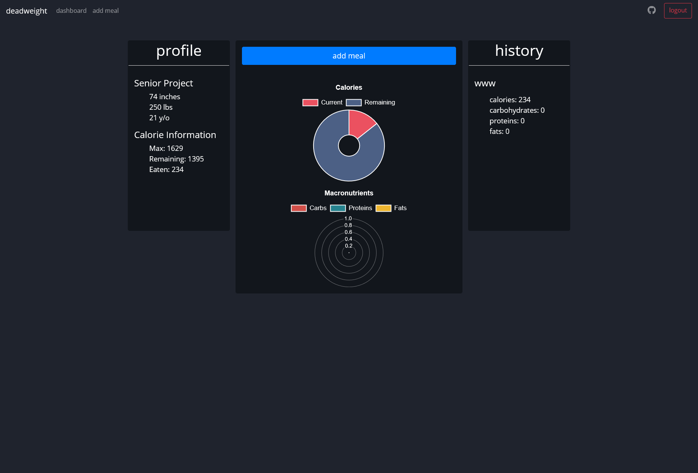
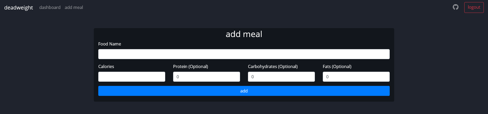
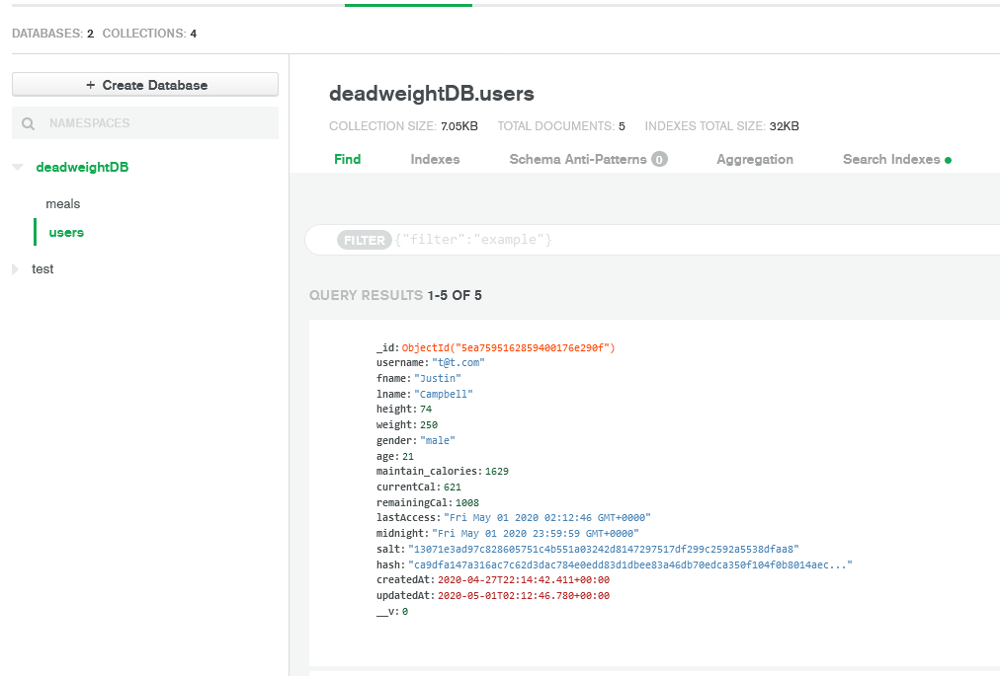

<link rel="stylesheet" type="text/css" href="/css/links.css" />

    
    

Deadweight was my senior/capstone project at Plymouth State University. With this project, we had to work on a project that we came up with ourselves and do something that showed off what we learned over the 4 *long* years. 

For this project, I decided to make a calorite tracking webapp. I came up with the idea to make a calorie tracking app after my own search for a minimalistic calorie tracking app that didn't have any ads or social integration. Unfortunately, like every big app had both of those things. And I mean *a lot* of those things. 

My proposal for this project would've been denied, except my condition for it passing was to use a new tech-stack that I've never used before. I chose to use the MExN stack, with the intention of using React (MERN) to create a nice Single-Page Application. My only experience with this stack was using Node to create a Discord Bot previously. So, I took this as a chance to learn a stack that was cool and hip in the web development world (Spoiler alert: I wasn't able to implement React in time 😢). 

With that said, my goals for the project followed something along these lines;
- Create a responsive webapp to track weight and CICO (calories in/calories out)
- Make the website as minimalistic as possible, but still functions and is easy to use
- Visual data in a way that makes sense and is easy to show your progress

I think I accomplished my goals relatively well for it being my first project in the stack.

Here's the homepage after a user signs up for Deadweight.  You can see your general information, your daily calorie intake, and also a history of your meals on the side. 

Here a user can add a meal. They add a name and calories and can choose to add some macronutrients if they want.

This is what the database looks like. I have a users table that stores user information, and then a meals table which stores the meal informaiton. 

Here's a video that I did showcasing my Deadweight, as well as explaining some of the process I went through.
<iframe width="100%" height="400" src="https://www.youtube.com/embed/2BEziZQ9Ljg" title="YouTube video player" frameborder="0" allow="accelerometer; autoplay; clipboard-write; encrypted-media; gyroscope; picture-in-picture" allowfullscreen></iframe>