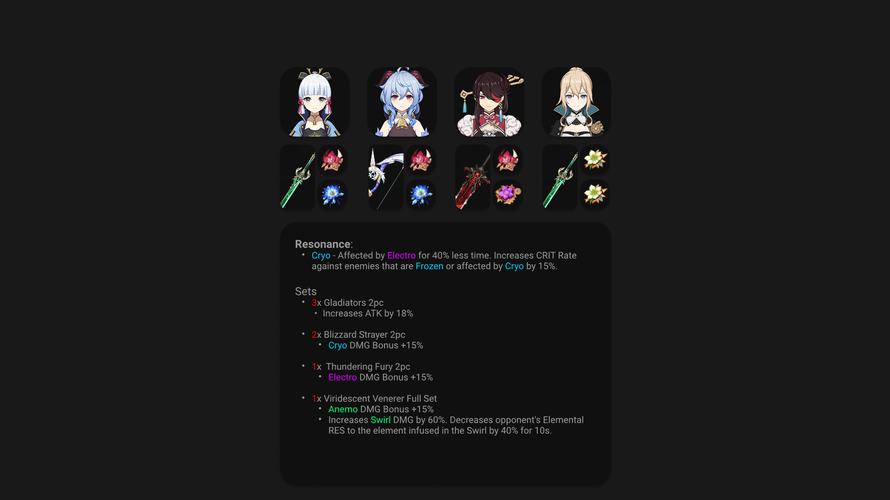

Just Another Genshin Tool, or JAGT for short, is a project I'm working on periodically. The idea of this project is to create a tool for players of Genshin Impact to use to help visualize team compositions and then share those with others. Most theorycrafting done in game-related discords is usually just either in text or done in spreadsheets. Well, there's no pictures in either of those! And I like pictures!

So, I started to create a few designs using Figma until I created a UI mockup of what I wanted the website to look like in the end. 

Here, it shows every character of your party, shows their gear setup, and also shows a summary of your team comp. A user can click on a character to change the character, click on a weapon to change the weapon, and click on an artifact to change the artifact. 

The idea from this page is that you can either screenshot or export/copy a picture of your team comp and summary to your clipboard to send to people, so that it's easier to visualize what a team comp might look like. 

I also planned on implementing the database I use for this and shoving it into a Discord Bot so that during conversations you can just do a quick command in chat to pull up information about a character, item, or artifact. 