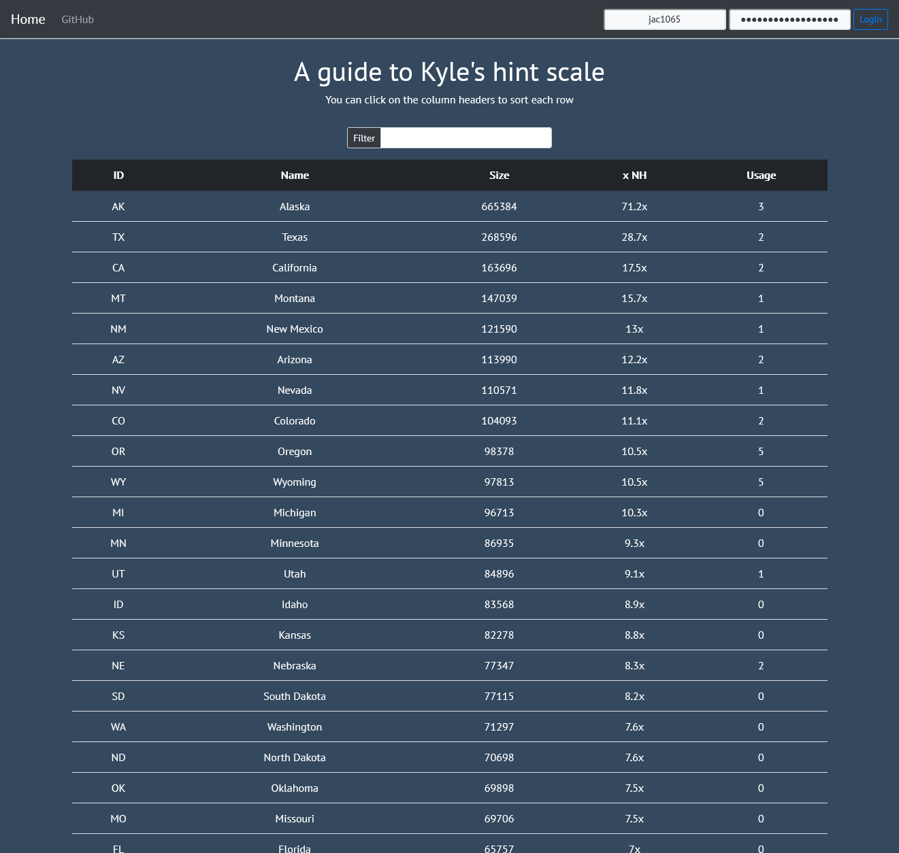

<link rel="stylesheet" type="text/css" href="/css/links.css" />

    
    

This project was a fun little project I did while taking classes with one of my favorite professors I had in college, [Kyle Burke](https://github.com/paithan). Kyle loved to give hints on projects and in class, and he referred to how helpful they were by the size of a state. For example, for some hint that might essentially give you the answer, he might say "Here's a Texas sized hint". After having him for many classes, I thought it'd be fun to create a little website to track his usage, as well as letting you compare state sizes to know what magnitude of hint you're getting. It also compares it to the size of New Hampshrie, so you truly know the scale of the hint you're getting. 

This was made using PHP and MySQL (I think the school is running MariaDB now). 

Unfortunately, I stopped keeping count after a while, and made accounts for other students to use, but no one ever tracked it, so not much information was tracked. 